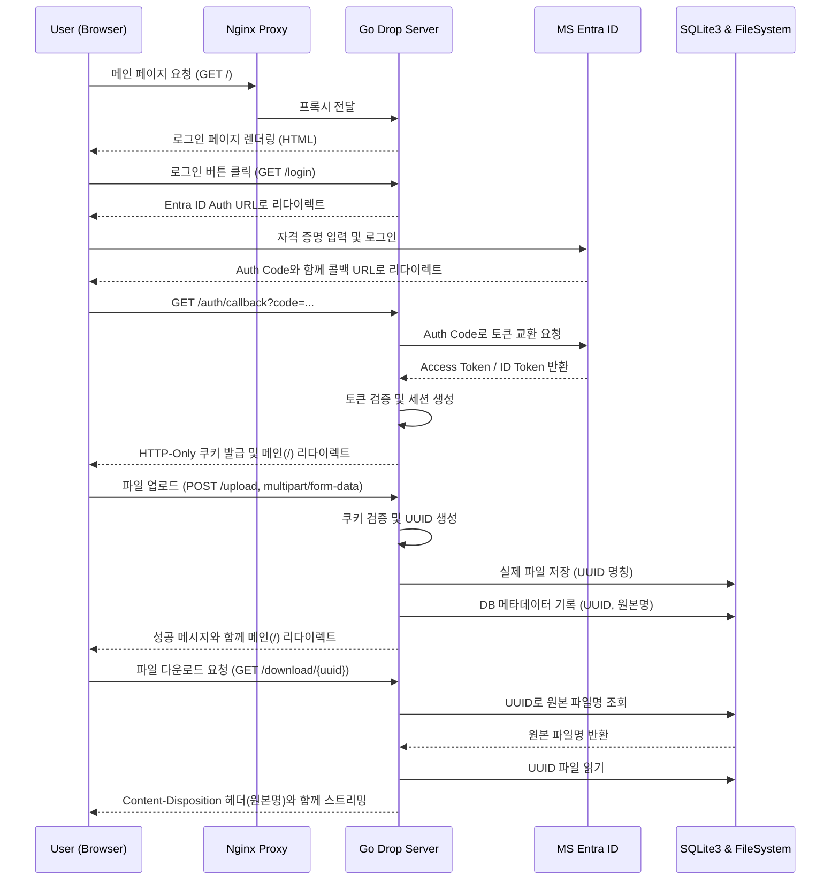

# DROP.PLUS.OR.KR

가볍고 안전한 파일 공유를 위한 초경량 드롭 서버(Drop Server) 아키텍처 문서입니다. 

## 🌟 서비스 특징 (Service Characteristics)

1. **JS-Free 프론트엔드**: JavaScript를 전혀 사용하지 않고 순수 HTML과 CSS만으로 구성됩니다. 이를 통해 클라이언트 사이드 취약점(XSS 등)을 원천적으로 차단하며 매우 빠른 로딩 속도를 보장합니다.
2. **Web Server-less 백엔드**: 앱 내부에 Apache나 Nginx 같은 별도의 웹 서버 엔진을 두지 않고, Golang의 내장 HTTP 라이브러리(`net/http`)만을 사용하여 백엔드를 구성합니다.
3. **Microsoft Entra ID 인증**: 사내 또는 허용된 사용자만 접근할 수 있도록 Microsoft Entra ID(구 Azure AD)를 통한 OAuth2 인증을 적용합니다.
4. **보안 파일 스토리지 시스템**: 파일 시스템에는 UUID(고유 식별자) 기반으로 파일이 저장되며, 원래의 파일명 및 메타데이터는 초경량 데이터베이스인 SQLite3에 분리되어 매핑/저장됩니다.
5. **사용자별 격리된 디렉토리 및 권한 분리**: 각 사용자(Entra ID 기반)마다 고유한 디렉토리가 할당됩니다. **읽기(다운로드)는 누구나 가능하지만, 쓰기(업로드, 수정, 삭제)는 해당 디렉토리의 소유자만 가능**하도록 권한이 엄격히 통제됩니다.
6. **Nginx-Proxy 기반 Docker 배포**: 전체 서비스는 Docker 컨테이너화 되며, 외부 라우팅 및 리버스 프록시는 `nginx-proxy` 컨테이너가 전담하여 트래픽을 처리합니다.

---

## 🏛 시스템 아키텍처 (Architecture)

### 컴포넌트 구성
* **Reverse Proxy**: `jwilder/nginx-proxy` (또는 호환 이미지) - 도메인 라우팅, 포트 포워딩 담당
* **Application**: Golang - 라우팅, 인증 처리, HTML 템플릿 렌더링, 파일 I/O 담당
* **Database**: SQLite3 - 파일 메타데이터(UUID, 원본 파일명, 업로더 정보, 시간) 저장
* **Storage**: Docker Volume - UUID 이름으로 변경된 실제 파일이 저장되는 물리적 공간
* **Identity Provider**: Microsoft Entra ID - 사용자 인증 및 인가

---

## 🔄 통신 및 동작 흐름 (Communication Flow)



### 흐름 상세 설명
1. **서버 사이드 렌더링(SSR)**: 모든 UI는 JS의 Fetch/AJAX 없이 Go 애플리케이션 내의 템플릿 엔진을 통해 HTML로 렌더링되어 클라이언트에 전달됩니다.
2. **보안 세션**: 로그인 성공 시 발급되는 세션은 프론트엔드에서 접근할 수 없도록 반드시 `HTTP-Only` 속성이 부여된 쿠키로 전달됩니다.
3. **전통적인 Form 제출**: 파일 업로드는 JavaScript를 통한 비동기 전송이 아닌, HTML의 표준 `<form enctype="multipart/form-data">` 속성을 이용한 동기적 POST 요청으로 이루어집니다.

### JS-Free 환경에서의 PUT, PATCH, DELETE 처리 (Method Override)
순수 HTML `<form>` 태그는 `GET`과 `POST` 메서드만 지원합니다. JS를 쓰지 않고 RESTful한 API(PUT, PATCH, DELETE)를 구현하려면 **Method Override(메서드 오버라이드)** 패턴을 사용해야 합니다.

* **구현 방법**: HTML 폼은 `POST`로 전송하되, 내부에 `<input type="hidden" name="_method" value="DELETE">`와 같은 히든 필드를 추가하거나, URL 쿼리 파라미터로 `?_method=DELETE`를 넘깁니다.
* **백엔드 처리**: Golang 백엔드 미들웨어에서 `POST` 요청을 가로챈 뒤, `_method` 값을 확인하여 내부적으로 라우팅을 `DELETE`, `PUT`, `PATCH`로 변환하여 처리합니다.
* **POST 방식과의 비교**:
  * **순수 POST 방식**: `<form action="/delete/123" method="POST">` 처럼 URL에 행위(delete)가 노출되어 RESTful 원칙에 어긋납니다.
  * **Method Override 방식**: `<form action="/files/123" method="POST"><input type="hidden" name="_method" value="DELETE"></form>` 형태가 되어, URL 자원(`/files/123`)을 명확히 하고 백엔드 라우터에서 RESTful하게 컨트롤러를 분리할 수 있어 코드가 깔끔해집니다.

---

## 📁 예상 디렉토리 구조 (Directory Structure)

```text
drop.plus.or.kr/
├── .gitignore
├── README.md                 # 현재 문서
├── docker-compose.yml        # nginx-proxy 및 앱 컨테이너 오케스트레이션 구성
├── Dockerfile                # Go 애플리케이션 멀티 스테이지 빌드 설정
├── go.mod                    # Go 모듈 종속성 정의
├── main.go                   # 애플리케이션 진입점 및 HTTP 서버 초기화
├── config/                   # 환경 변수 및 인증 설정 로드 로직
├── handlers/                 # HTTP 라우트 핸들러 (메인, 로그인, 콜백, 업로드, 다운로드)
├── models/                   # SQLite3 DB 초기화 및 데이터 쿼리 로직
├── templates/                # 순수 HTML 템플릿 폴더 (JS 없음)
│   └── index.html            # UI 레이아웃 및 폼 구성
└── data/                     # 도커 볼륨 마운트 지점 (git에서 제외됨)
    ├── drop.db               # SQLite3 데이터베이스 파일
    └── uploads/              # UUID로 변환된 실제 업로드 파일 보관소
```
